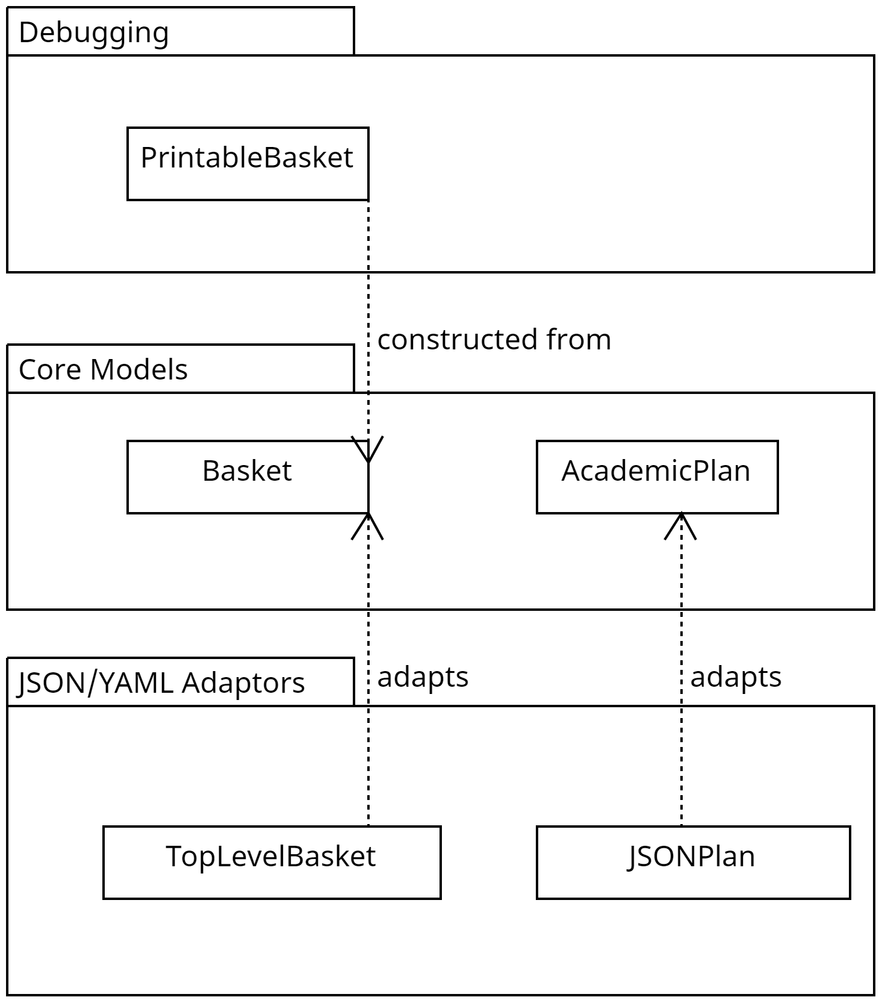
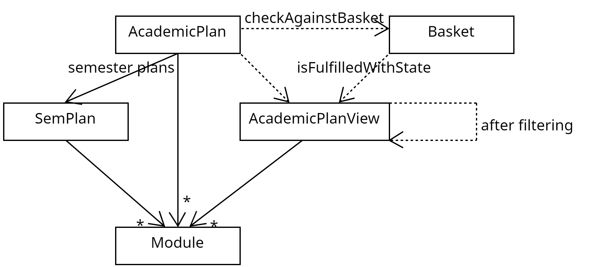
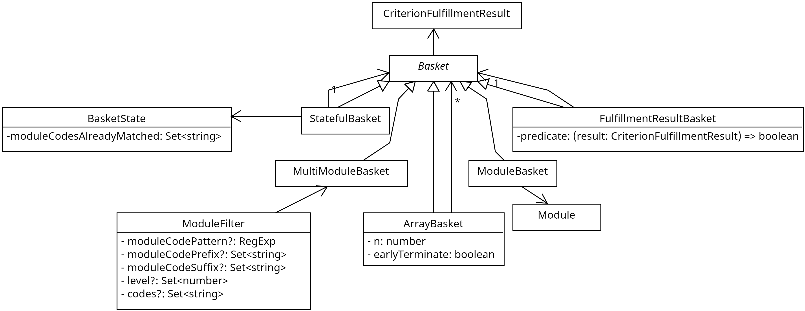

### Development commands
- The usual Next.js commands, e.g. `next start` for the local dev server.
- `npm run test -- <path_to_requirements_file> <path_to_academic_plan_file>` will verify the given academic plan json/yaml file with the given requirements json/yaml file and print out a bunch of relatively readable objects (`PrintableBasket`) in the console. See `PrintableBasket` in [basket.ts](..src/models/basket.ts).
  See these [Powershell](../locals/scripts/Test.ps1) and [Sh](../locals/scripts/test.sh) scripts for examples.

### Models

[//]: # "This is copied over from our report. Can be made more concise in some areas and more detailed in others."

The application uses the model-viewmodel-view architecture (all of which reside in the frontend).
The model consists of the core requirement validation logic.
The viewmodel wraps the model and has view-specific information.
The view consists of the React components and Next.js pages.

It is also worth mentioning other utilities that do not fall strictly into these categories.
First, some validation logic is done in utility functions instead of the core model layer. This includes checking for preclusions, prerequisites and corequisites. This helps to alleviate some complexity in the core model layer since such validation can be done solely from the information retrieved from NUSMods.

Second, there are debugging and test helpers to better test and display the model layer’s output to the developer.

The high-level UML diagram below categorises the model layer into 3 main categories, the models involved in domain logic (Core Models), models suited for debugging, and JSON/YAML-friendly versions of the core models.

Degree Validation mainly needs 2 things, first, a student’s academic plan and a degree requirement. The academic plan is encapsulated in the AcademicPlan and its child objects. The degree requirement is encapsulated in `Basket` and its subclasses.

To aid debugging, a `PrintableBasket` can be constructed from Basket and strips away most information, keeping only information that is more readable to a human. An object as complicated as a Javascript class usually cannot be directly translated to JSON/YAML, so we also designed mapper types like `TopLevelBasket` and `JSONPlan` to map JSON/YAML structures to the core models.
We were conscious when structuring the JSON/YAML structures to minimise the amount of nesting required to improve the user experience. To be precise, a single nesting level in the JSON can sometimes translate to 2 or more nested objects in our core models. We hope that future contributors to our project’s degree requirement JSON/YAML files would find this convenient.

Another secondary benefit of creating these JSON/YAML structures is their usage in testing. Our test suites make use of test plans, as well as test requirements, and to test, we simply observe the output of test requirement JSON validating against test plan JSON.

Here are the models related to the academic plan in greater detail.

The `AcademicPlan` is the primary model encapsulating 4-5 years of the student’s academic journey. Within it, we split each semester into a `SemPlan`. The `AcademicPlan` can be checked against a `Basket`. During this checking, the model fed into the `Basket` for validation is called `AcademicPlanView`.

`AcademicPlanView` is a window into the full `AcademicPlan`, and the modules that it contains are a subset (usually a strict subset) of the modules under `AcademicPlan`. It is most useful when we need to filter some modules out temporarily during validation, but we don’t want to mutate `AcademicPlan` itself.

As we can see from the diagram, `AcademicPlan` creates an `AcademicPlanView` containing all the modules inside `AcademicPlan`. `AcademicPlanView` is also able to create another `AcademicPlanView` whose modules are a subset of the full set of modules in `AcademicPlan`.

Next, we can examine the basket models. `Basket` is an abstract class, and it has the following implementing subclasses.
Note: There is also an `EmptyBasket` class, but that’s not very interesting.

Fundamentally, a `Basket` plays the following roles
Contains some kind of requirement, that evaluates to `true` (requirement met) or `false` (requirement is not met)
Stores some state with regard to the result of the last validation.
Possibly contain one or more child baskets. If it does, then its requirement should have some kind of dependency on the child baskets.

A degree requirement is modelled by a tree of baskets. `Basket`s at the bottom level are called `ModuleBasket` and `MultiModuleBasket`. The other basket classes will contain one or more child baskets.

`ModuleBasket`
- Represents a single module
- Fulfilled if and only if the module is taken (in the `AcademicPlanView`)

`MultiModuleBasket`
- Represents a group of modules filtered by some filter (`ModuleFilter`). For instance, this can be something like “all level 4000 CS modules”.
- Fulfilment depends on how many modules in the `AcademicPlanView` are matched with this basket’s `ModuleFilter`

As we can see, the bottom level of the requirement must be some kind of module, be it a well-specified module (as in `ModuleBasket`), or some filter-defined module collection (as in `MultiModuleBasket`).

`ArrayBasket`
- Represents a collection of basket requirements
- Depending on how its parameters (n, earlyTerminate) are set, it can mimic behaviours such as:
OR condition, i.e. at least one of its child basket requirements is fulfilled
AND condition, i.e. all of its child baskets are fulfilled
At least n child basket requirements fulfilled condition

`FulfillmentResultBasket`
- Represents an additional condition that must be met after its child basket is validated.
- The predicate is very free-form and is mainly used to check that a certain number of MCs have been matched.

`StatefulBasket`
- Mainly used to prevent double counting of modules. When modules are counted toward one requirement, the `StatefulBasket` prevents those modules from being counted toward another requirement.
- Such double-counting prevention behaviour can be fine-tuned by deciding which `BasketState` objects are shared by `StatefulBasket`s.

The viewmodel layer’s `MainViewModel` wraps around these structures, and the various parts of the viewmodel act as the state for the React components.

